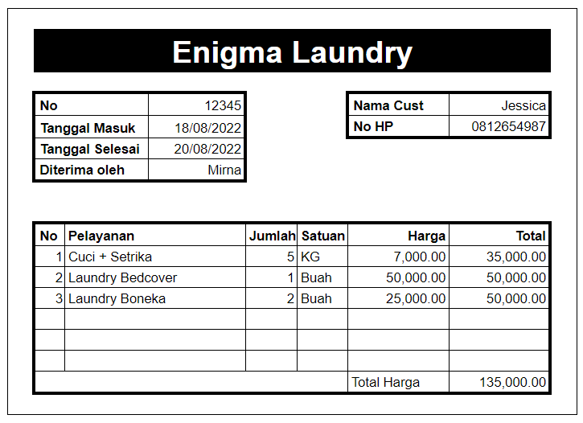

# Aplikasi Enigma Laundry

### Deskripsi

Setelah menyelesaikan pembelajaran tentang Go API, Anda ditugaskan oleh manajemen Enigma Laundry (EL) untuk membuat sebuah aplikasi sederhana berbasis API untuk mencatat transaksi di tokonya.



Fitur-fitur yang diminta oleh manajemen EL adalah:

1.  Struktur/Design Database yang memenuhi kaidah normalisasi berdasarkan nota dibawah ini dengan kriteria sbb :

        - Hasil design dalam bentuk file Script DDL Postgre SQL
        - Design database minimal memiliki 2 tabel master dan 1 tabel transaksi
        - Sediakan sample data dalam bentuk Script DML Postgre SQL

2.  Aplikasi berbasis API menggunakan bahasa pemrograman Golang dengan kriteria sbb :

        - Aplikasi memiliki fitur untuk melakukan GET, POST, PUT, dan DELETE pada tabel master
          1. Manajemen Customer
          2. Manajemen Produk
          3. Manajemen Employee
        - Aplikasi memiliki fitur untuk melakukan GET dan POST pada table Transaksi
          1. Manajemen Transaksi
        - Setiap fitur master wajib memiliki minimal 2 jenis validasi yang berbeda
        - Setiap transaksi master wajib memiliki minimal 4 jenis validasi yang berbeda

3.  Dokumentasi cara menjalankan aplikasi dan penggunaan aplikasi dalam bentuk readme.md atau dokumen ektensi word atau pdf

- - -

## API Spec

### Customer API

#### Create Customer

Request :

- Method : `POST`
- Endpoint : `/customers`
- Header :
  - Content-Type : application/json
  - Accept : application/json
- Body :

```json
{
  "name": "string",
  "phoneNumber": "string",
  "address": "string"
}
```

Response :

- Status : 201 Created
- Body :

```json
{
  "message": "string",
  "data": {
    "id": "string",
    "name": "string",
    "phoneNumber": "string",
    "address": "string"
  }
}
```

#### Get Customer

Request :

- Method : GET
- Endpoint : `/customers/:id`
- Header :
  - Accept : application/json

Response :

- Status : 200 OK
- Body :

```json
{
  "message": "string",
  "data": {
    "id": "string",
    "name": "string",
    "phoneNumber": "string",
    "address": "string"
  }
}
```

#### Update Customer

Request :

- Method : PUT
- Endpoint : `/customers/:id`
- Header :
  - Content-Type : application/json
  - Accept : application/json
- Body :

```json
{
  "name": "string",
  "phoneNumber": "string",
  "address": "string"
}
```

Response :

- Status : 200 OK
- Body :

```json
{
  "message": "string",
  "data": {
    "id": "string",
    "name": "string",
    "phoneNumber": "string",
    "address": "string"
  }
}
```

#### Delete Customer

Request :

- Method : DELETE
- Endpoint : `/customers/:id`
- Header :
  - Accept : application/json
- Body :

Response :

- Status : 200 OK
- Body :

```json
{
  "message": "string",
  "data": "OK"
}
```

### Product API

#### Create Product

Request :

- Method : POST
- Endpoint : `/products`
- Header :
  - Content-Type : application/json
  - Accept : application/json
- Body :

```json
{
	"name": "string",
  "price": int,
  "unit": "string" (satuan product,cth: Buah atau Kg)
}
```

Response :

- Status Code: 201 Created
- Body:

```json
{
	"message": "string",
	"data": {
		"id": "string",
		"name": "string",
		"price": int,
		"unit": "string" (satuan product,cth: Buah atau Kg)
	}
}
```

#### List Product

Request :

- Method : GET
- Endpoint : `/products`
  - Header :
  - Accept : application/json
- Query Param :
  - productName : string `optional`,

Response :

- Status Code : 200 OK
- Body:

```json
{
	"message": "string",
	"data": [
		{
			"id": "string",
			"name": "string",
			"price": int,
			"unit": "string" (satuan product,cth: Buah atau Kg)
		},
		{
			"id": "string",
			"name": "string",
			"price": int,
			"unit": "string" (satuan product,cth: Buah atau Kg)
		}
	]
}
```

#### Product By Id

Request :

- Method : GET
- Endpoint : `/products/:id`
- Header :
  - Accept : application/json

Response :

- Status Code: 200 OK
- Body :

```json
{
	"message": "string",
	"data": {
		"id": "string",
		"name": "string",
		"price": int,
		"unit": "string" (satuan product,cth: Buah atau Kg)
	}
}
```

#### Update Product

Request :

- Method : PUT
- Endpoint : `/products/:id`
- Header :
  - Content-Type : application/json
  - Accept : application/json
- Body :

```json
{
	"name": "string",
	"price": int,
	"unit": "string" (satuan product,cth: Buah atau Kg)
}
```

Response :

- Status Code: 200 OK
- Body :

```json
{
	"message": "string",
	"data": {
		"id": "string",
		"name": "string",
		"price": int,
		"unit": "string" (satuan product,cth: Buah atau Kg)
	}
}
```

#### Delete Product

Request :

- Method : DELETE
- Endpoint : `/products/:id`
- Header :
  - Accept : application/json
- Body :

Response :

- Status : 200 OK
- Body :

```json
{
  "message": "string",
  "data": "OK"
}
```

### Transaction API

#### Create Transaction

Request :

- Method : POST
- Endpoint : `/transactions`
- Header :
  - Content-Type : application/json
  - Accept : application/json
- Body :

```json
{
	"billDate": "string",
	"entryDate": "string",
	"finishDate": "string",
	"employeeId": "string",
	"customerId": "string",
	"billDetails": [
		{
			"productId": "string",
			"qty": int
		}
	]
}
```

Request :

- Status Code: 201 Created
- Body :

```json
{
	"message": "string",
	"data":  {
		"id":  "string",
		"billDate":  "string",
		"entryDate":  "string",
		"finishDate":  "string",
		"employeeId":  "string",
		"customerId":  "string",
		"billDetails":  [
			{
				"id":	"string",
				"billId":  "string",
				"productId":  "string",
				"productPrice": int,
				"qty": int
			}
		]
	}
}
```

#### Get Transaction

Request :

- Method : GET
- Endpoint : `/transactions/:id_bill`
- Header :
  - Accept : application/json
- Body :

Response :

- Status Code: 200 OK
- Body :

```json
{
	"message": "string",
  "data": {
    "id": "string",
    "billDate": "string",
    "entryDate": "string",
    "finishDate": "string",
    "employee": {
      "id": "string",
      "name": "string",
      "phoneNumber": "string",
      "address": "string"
    },
    "customer": {
      "id": "string",
      "name": "string",
      "phoneNumber": "string",
      "address": "string"
    },
    "billDetails": [
      {
        "id": "string",
        "billId": "string",
        "product": {
          "id": "string",
          "name": "string",
          "price": int,
          "unit": "string" (satuan product,cth: Buah atau Kg)
        },
        "productPrice": int,
        "qty": int
      }
    ],
    "totalBill": int
  }
}
```

#### List Transaction

Pattern string date : `dd-MM-yyyy`

Request :

- Method : GET
- Endpoint : `/transactions`
- Header :
  - Accept : application/json
- Query Param :
  - startDate : string `optional`
  - endDate : string `optional`
  - productName : string `optional`
- Body :

Response :

- Status Code: 200 OK
- Body :

```json
{
	"message": "string",
  "data": [
    {
      "id": "string",
      "billDate": "string",
      "entryDate": "string",
      "finishDate": "string",
      "employee": {
        "id": "string",
        "name": "string",
        "phoneNumber": "string",
        "address": "string"
      },
      "customer": {
        "id": "string",
        "name": "string",
        "phoneNumber": "string",
        "address": "string"
      },
      "billDetails": [
        {
          "id": "string",
          "billId": "string",
          "product": {
            "id": "string",
            "name": "string",
            "price": int,
            "unit": "string" (satuan product,cth: Buah atau Kg)
          },
          "productPrice": int,
          "qty": int
        }
      ],
      "totalBill": int
    }
  ]
}
```
